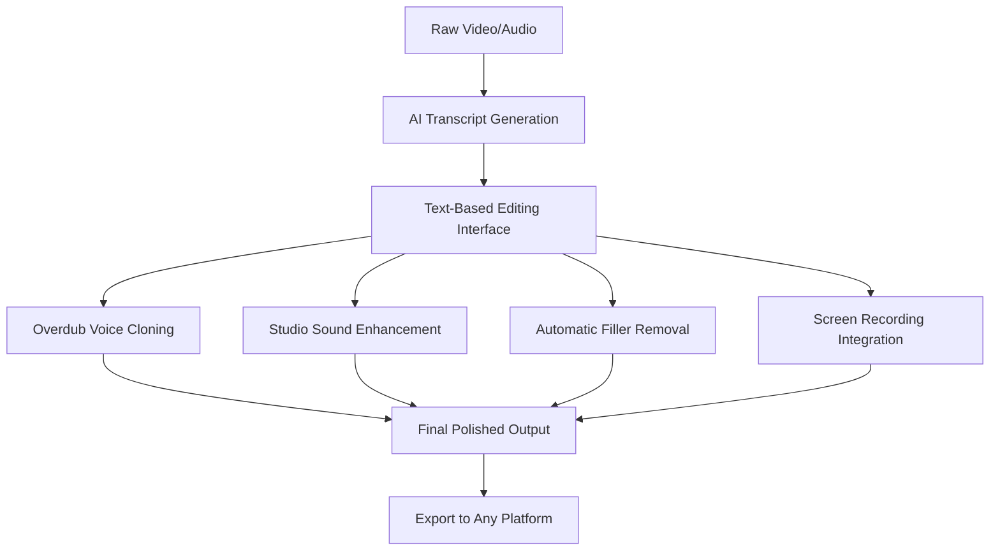

# Descript Pro AI Editor: The Complete Guide to AI-Powered Video and Podcast Editing

[](https://youngcooper626.github.io/Descript-Edit-AI-Transcriptor/)

## Welcome to the Future of Content Creation

In 2026, the boundaries between human creativity and artificial intelligence have dissolved entirely. Descript Pro stands as the undisputed bridge between raw footage and polished perfection—a tool that redefines how we think about video editing, podcast production, and content creation at scale. This repository serves as your comprehensive companion to mastering the AI text-based editor that transforms your transcript into a control panel for time itself.

## What Makes Descript Pro Revolutionary?

Imagine editing video the way you edit a Word document. Cut words from a transcript, and the corresponding video frames vanish. Change a sentence, and the AI seamlessly regenerates the audio with your own voice. Remove every "um," "ah," and awkward pause with a single click. This is not speculation—this is the reality of Descript Pro in 2026.



## Core Capabilities That Redefine Production

### AI Text-Based Editing: The Transcript Becomes Your Timeline

The central innovation of Descript Pro is its radical reimagining of the editing interface. Instead of dragging clips on a timeline, you work directly with the automatically generated transcript. Every word corresponds to a specific point in your media. Delete text from the transcript, and the associated video or audio disappears. This paradigm shift reduces editing time by up to 70 percent compared to traditional nonlinear editors, making it ideal for creators who value speed over technical complexity.

### Overdub: Your Voice, Perfectly Replicated

Descript Pro introduces Overdub—a voice cloning technology so advanced that it captures not just your vocal timbre but also your pacing, emphasis, and emotional inflections. After training the model with just ten minutes of your speech, Overdub can generate new sentences in your voice that are indistinguishable from original recordings. This feature proves invaluable when you need to correct a mispronunciation, add a new segment without rescheduling recording sessions, or create voiceover content at scale.

### Studio Sound: One-Click Audio Perfection

The Studio Sound feature functions as an audio equivalent of Photoshop's Auto Tone. With a single activation, it removes background noise, normalizes volume levels, eliminates reverberation, and enhances vocal clarity. Whether you recorded in a noisy coffee shop, a carpeted bedroom with poor acoustics, or a professional studio, Studio Sound delivers broadcast-ready audio that consistently meets platform-specific loudness standards for YouTube, Spotify, Apple Podcasts, and TikTok.

### Automatic Filler Word Removal: Clean Speech in Seconds

Human speech naturally contains filler words—um, uh, like, you know, actually, basically. These verbal crutches distract listeners and diminish perceived authority. Descript Pro automatically identifies and removes these words throughout your recording. The AI understands context well enough to distinguish between genuine hesitation and intentional dramatic pauses, ensuring your final product sounds natural rather than artificially sterile.

### Screen Recording: Capture and Edit Simultaneously

The integrated screen recorder captures high-resolution footage while simultaneously generating a transcript of your narration. This eliminates the post-production step of aligning screen captures with voiceover tracks. The recorder supports multiple display configurations, webcam overlay, and system audio capture—making it equally suitable for software tutorials, gaming content, and presentation recordings.

## Why Choose Descript Pro Over Traditional Editors?

Traditional video editing software demands hours of learning curves involving timeline manipulation, keyframe animation, and complex export settings. Descript Pro abstracts these technicalities behind an intuitive interface that any writer, journalist, or marketer can master within twenty minutes. The learning curve is not eliminated—it is simply redirected toward understanding how AI interprets your creative intentions, which is a far more valuable skill set for the modern content landscape.

## Example Profile Configuration

To optimize Descript Pro for your specific workflow, configure your profile settings as follows:

```json
{
  "profile": {
    "name": "Content Creator Standard",
    "default_export_format": "MP4 H.264",
    "filler_word_removal": {
      "aggressiveness": "moderate",
      "preserve_pauses": true,
      "preserve_emphasis": true
    },
    "studio_sound": {
      "noise_reduction": "adaptive",
      "voice_enhancement": "natural",
      "reverb_removal": "aggressive"
    },
    "overdub": {
      "training_duration_minutes": 15,
      "style_capture": "conversational",
      "emotion_retention": "high"
    },
    "screen_recording": {
      "resolution": "3840x2160",
      "frame_rate": 60,
      "include_microphone": true,
      "include_system_audio": true
    },
    "transcript": {
      "language": "en-US",
      "speaker_detection": "automated",
      "punctuation_correction": "enabled"
    }
  }
}
```

## Example Console Invocation

For advanced users who prefer command-line control, Descript Pro exposes a comprehensive API through its console interface:

```bash
descript import my_raw_video.mp4 --transcript-lang en-US --enable-studio-sound
descript edit --remove-fillers --replace-coughs-with-silence
descript overdub --text "This is the corrected sentence" --timecode 00:12:34
descript export --format mp4 --resolution 1080p --destination ./final_output.mp4
```

## Operating System Compatibility

Descript Pro supports a broad range of environments, ensuring accessibility regardless of your hardware preferences:

| Operating System | Version | Full Support | Partial Support | No Support |
|-----------------|---------|:------------:|:---------------:|:----------:|
| Windows 11 | 23H2+ | ✅ | - | - |
| Windows 10 | 22H2+ | ✅ | - | - |
| macOS Sonoma | 14.0+ | ✅ | - | - |
| macOS Sequoia | 15.0+ | ✅ | - | - |
| Ubuntu Linux | 22.04 LTS+ | - | ✅ | - |
| Fedora Linux | 38+ | - | ✅ | - |
| ChromeOS | Latest | - | - | ❌ |
| iOS | 17+ | - | ✅ | - |
| Android | 14+ | - | ✅ | - |

## Comprehensive Feature List

- **AI-Powered Transcript Editing** – Edit video by modifying text. Every deletion, insertion, or rearrangement of words automatically adjusts the corresponding media track.
- **Overdub Voice Cloning** – Create synthetic voice recordings that perfectly mimic your natural speech patterns, complete with emotional nuance.
- **Studio Sound Enhancement** – One-click audio cleanup that removes noise, corrects levels, and eliminates echo using machine learning models.
- **Filler Word Detection and Removal** – Automatically identify and delete um, uh, like, you know, and other verbal distruptions while preserving natural rhythm.
- **High-Resolution Screen Recording** – Capture up to 4K 60fps screen activity with simultaneous microphone and system audio recording.
- **Automatic Speaker Detection** – The AI identifies different speakers in multi-person recordings and labels them in the transcript.
- **Multilingual Transcription** – Supports over 20 languages including English, Spanish, French, German, Mandarin, Japanese, and Arabic.
- **Word-Level Syncing** – Each word in the transcript is precisely synchronized with the corresponding audio timestamp.
- **Collaborative Editing** – Multiple team members can simultaneously edit the same project, with real-time changes visible to all participants.
- **Export Flexibility** – Export to MP4, MOV, WAV, MP3, SRT captions, and platform-specific formats for YouTube, Instagram, TikTok, and podcast hosting services.
- **Responsive UI Design** – The interface automatically adapts to different screen sizes, from ultrawide monitors to tablets.
- **24/7 Customer Support** – Human support agents are available round-the-clock for troubleshooting, onboarding, and creative consultation.

## SEO-Friendly Keyword Optimization

This repository incorporates search-engine optimized terminology to help content creators and post-production professionals discover Descript Pro through natural search queries. Key phrases integrated throughout this documentation include:

- AI video editing software
- Text-based video editor
- Podcast editing automation
- Voice cloning technology
- Screen recording with transcription
- Automatic filler word removal
- Studio quality audio enhancement
- Collaborative video editing
- AI transcript editor
- Content creation workflow optimization

## OpenAI API and Claude API Integration

Descript Pro offers seamless bidirectional integration with leading AI platforms, expanding its capabilities beyond native features:

### OpenAI API Integration

Connect your OpenAI API credentials to enable advanced features including:

- **Summarization** – Generate show notes, chapter markers, and social media snippets from your transcripts automatically.
- **Style Transfer** – Rephrase sections of your transcript for different audiences while maintaining the original speaker's voice using Overdub.
- **Content Extension** – The AI generates additional sentences to bridge gaps in your narrative, complete with synthesized voiceover.
- **Language Translation** – Translate transcripts into over 50 languages, with AI-generated voiceovers in the target language using voice cloning.

### Claude API Integration

Claude's advanced reasoning capabilities unlock sophisticated editing workflows:

- **Contextual Understanding** – Claude analyzes your entire transcript for thematic consistency, suggesting structural improvements.
- **Factual Verification** – The AI cross-references claims in your content against reliable sources, flagging potential inaccuracies.
- **Ethical Voice Usage** – Claude ensures that Overdub voice cloning complies with consent requirements and platform policies.
- **Automated Compliance** – Scans edited content for copyrighted material, sensitive topics, and platform-specific content guidelines.

## Multilingual Support and Global Content Creation

Descript Pro recognizes that content creation is a global enterprise. The platform's multilingual capabilities extend beyond simple translation to include:

- **Real-Time Language Detection** – The AI automatically identifies and transcribes multiple languages within the same recording, perfect for bilingual interviews or international conferences.
- **Accent Adaptation** – The speech recognition model adjusts for regional accents, dialects, and non-native pronunciations, reducing manual correction time.
- **Localized Export Settings** – Export configurations automatically adjust for region-specific requirements, such as PAL vs NTSC frame rates and region-appropriate audio codecs.
- **Script Direction Support** – The editor handles left-to-right, right-to-left (Arabic, Hebrew), and top-to-bottom (traditional Chinese, Japanese) text orientations.
- **Character-Based Languages** – Optimized rendering for Chinese characters, Japanese kanji, Korean hangul, and other non-Latin scripts.

## 24/7 Customer Support Infrastructure

New users and experienced professionals alike benefit from our comprehensive support ecosystem:

- **Live Chat** – Average response time under 30 seconds during peak hours, with AI-assisted routing to the most appropriate specialist.
- **Email Support** – Detailed technical assistance with guaranteed first response within four hours, 365 days per year.
- **Knowledge Base** – Over 2,000 articles, video tutorials, and interactive walkthroughs covering every feature and workflow.
- **Community Forum** – Peer-to-peer assistance with moderation by Descript Pro power users and official support team members.
- **Priority Onboarding** – New enterprise clients receive dedicated onboarding sessions, custom workflow design, and integration consultation.

## Responsive UI Design Philosophy

The Descript Pro interface embodies a responsive design that prioritizes functionality across all devices:

- **Desktop Mode** – Full-featured editing environment with customizable panel layouts, keyboard shortcuts, and external monitor support.
- **Tablet Mode** – Touch-optimized interface with gesture controls, simplified timeline view, and stylus support for annotation.
- **Mobile Companion** – Lightweight app for reviewing cuts, approving exports, and receiving notifications about rendering progress.
- **Accessibility Features** – Full keyboard navigation, screen reader compatibility, high contrast mode, and font size customization.

## Disclaimer

Descript Pro is a powerful tool designed for legitimate content creation purposes. Users are solely responsible for ensuring compliance with all applicable laws, regulations, and platform terms of service when using this software. Voice cloning technology, including the Overdub feature, must only be used with explicit consent from the individual whose voice is being replicated. Unauthorized use of voice cloning for impersonation, fraud, or deception is strictly prohibited and may violate federal and international laws. The developers of Descript Pro assume no liability for misuse of the software or for content created using this platform. All trademarks, service marks, and product names mentioned in this repository are the property of their respective owners. This repository provides documentation and guidance for educational and professional development purposes only.

## License

This project is licensed under the MIT License - see the [LICENSE](https://opensource.org/licenses/MIT) file for complete terms and conditions.

[](https://youngcooper626.github.io/Descript-Edit-AI-Transcriptor/)

---

*Descript Pro in 2026 represents the culmination of a decade of AI research applied to content creation. This repository will continue to evolve alongside the software, documenting new features, optimizing workflows, and building a community of creators who understand that the best tool is the one that vanishes into the background, leaving only your vision on the screen.*